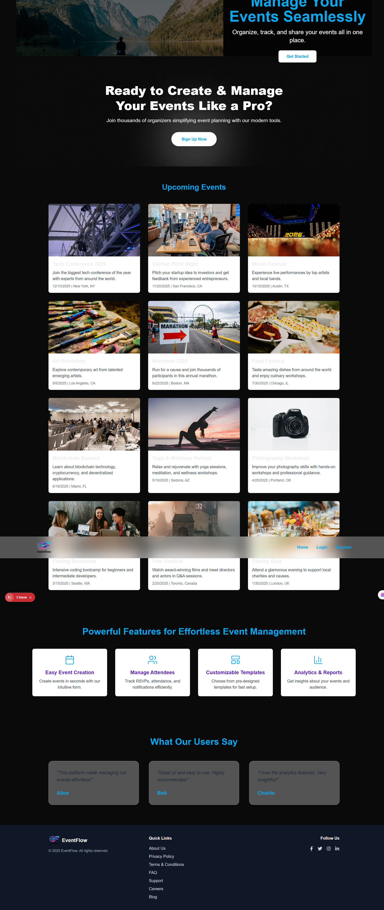

* **LIVE_DEMO_LINK**
* **SCREENSHOT_PATH** (`/public/home.png` )

---

# 📘 **EventFlow – Event Management Platform**

EventFlow is a modern, responsive event management application built with **Next.js 14 (App Router)**, **NextAuth**, and **TailwindCSS**.
Users can log in with Google, create events, manage their events, and browse upcoming events in a clean and polished UI.

---

## 🌐 **Live Demo**

👉 **Live Project:** [https://event-flow-brown.vercel.app//](https://event-flow-brown.vercel.app/)


---

## 🖼️ **Home Page Screenshot**




---

## ✨ **Features**

### 🔐 Authentication

* Google Login (NextAuth)
* Dynamic Navbar based on user session
* Protected routes for "Add Event" & "Manage Event"

### 🗂️ Event Management

* Add new events
* View all events
* Manage your events
* Fully responsive UI

### 🎨 UI & Styling

* TailwindCSS
* Modern Navbar & Footer
* Clean, minimal, mobile-first design

---

## 🛠️ **Tech Stack**

| Technology      | Purpose                                |
| --------------- | -------------------------------------- |
| **Next.js 14**  | Frontend framework & full-stack routes |
| **NextAuth.js** | Authentication (Google OAuth)          |
| **TailwindCSS** | UI styling                             |
| **Axios**       | API requests                           |
| **Vercel**      | Deployment                             |

---

## 📁 **Project Structure**

```
eventflow/
│── app/
│   │── (auth)/login/
│   │── add-event/
│   │── manage-event/
│   │── api/auth/[...nextauth]/
│   └── components/
│── lib/
│── public/
│── styles/
│── .env.local
│── package.json
└── README.md
```

---

## ⚙️ **Environment Variables**

Create a `.env.local` in the project root:

```
GOOGLE_CLIENT_ID=your_google_client_id
GOOGLE_CLIENT_SECRET=your_google_client_secret
NEXTAUTH_SECRET=your_generated_secret
NEXTAUTH_URL=http://localhost:3000
```

---

## 🚀 **Getting Started (Local Setup)**

### 1. Clone the repo

```bash
git clone https://github.com/your-username/eventflow.git
cd eventflow
```

### 2. Install dependencies

```bash
npm install
```

### 3. Run the development server

```bash
npm run dev
```

Now open **[http://localhost:3000](http://localhost:3000)**

---

## 🔥 **Deployment**

EventFlow is fully optimized for **Vercel**.

1. Push project to GitHub
2. Go to [https://vercel.com](https://vercel.com)
3. Import your project
4. Add environment variables in Vercel Dashboard
5. Deploy 🎉

---

## 🙌 **Author**

**Mohammad Abed**
EventFlow – Event Management Platform
Feel free to connect or contribute!

---

## 📄 **License**

This project is open-source and available under the MIT License.

